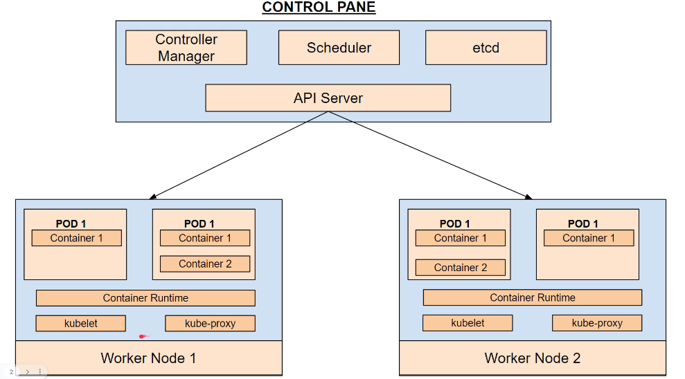

쿠버네티스는 여러 컨테이너를 관리하기 위한 도구이다. 쿠버네티스를 사용하면 다음과 같은 이점이 있다
1. Service Discovery and load balance
2. automate rollout and rollback
3. Horizontal Scaling
4. Self-Healing
5. Secret and Configuration Management

### 쿠버네티스 구조

Worker Node 는 내 어플리케이션을 실행하는 머신이다. 각각의 Node 는 Kubelet 을 갖고 있는데 
노드를 관리하거나 Control Pane 과 소통하는 역할을 한다. Pod 는 클러스터 내부에서 실행중인 프로세스이다.

Control Pane 은 여러 클러스터를 관리하는데 API Server 는 다른 클러스터(Node) 와 소통하는 인터페이스이다.
etcd 는 클러스터에 필요한 중요 정보를 저장한다. secret, config 등의 정보를 저장하는 분산 저장소이다.
Scheduler 는 어플리케이션 파드를 적절한 노드에 스케줄링 한다
Controller Manager 는 클러스터의 상태를 관리한다

### Minikube
로컬에선 쿠버네티스를 상요하기 위해 미니큐브를 다운받는다. 이는 개발환경에서의 세팅이므로
운영환경에선 EKS 와 같은 실제 쿠버네티스 클러스터를 사용해야한다. 미니큐브 사이트에 들어가 exe 파일을
다운받고 아래 명령어를 실행한다
```text
minikube start --driver=docker

minikube delete

// 쿠버네티스가 정상적으로 동작하는지 확인
kubectl cluster-info 

// 미니큐브 대시보드 보는 명령어
minikube dashboard
```

### Pod
파드는 한개 혹은 그 이상의 컨테이너 그룹이고 네트워크 포트, 아이피 주소 등 자원을 공유한다.
파드 내에서 동작하는 컨테이너는 같은 worker node 에서 동작하고 같은 라이프사이클을 가진다.

```text
// first-pod.yml
apiVersion: v1
kind: Pod
metadata:
  name: my-pod
spec:
  containers:
    - name: nginx
      image: nginx:1.14.2
      ports:
        - containerPort: 80
//    - name: redis
//     image: redis:6.2.5

// pod 생성, -f 는 파일명 지정 위함
kubectl apply -f first-pod.yml

// redis 추가 후 실행
kubectl apply -f first-pod.yml
-> 파드 수정은 파드를 지우거나 파드의 이름을 변경해야해 에러발생

kubectl get pods
```

### Service
클러스터 외부로부터 요청을 받을 수 있게 IP 를 노출하는 역할을 한다. 또한, Deployment 로 Pod 를
수평확장하는 상황에, 트래픽을 적절히 분산시키는 역할을 할 수 있다.
```text
kubectl apply -f first-service.yml

kubectl get service
```

### 서비스를 외부에 노출하는법
서비스를 노출하는 방법은 다음과 같다.
1. Node Port
2. LoadBalancer
3. ClusterIP

이 중, LoadBalancer를 가장 많이 사용한고 service 생성 시 타입을 명시해야한다
```text
apiVersion: v1
kind: Service
metadata:
  name: my-service
spec:
  selector:
    app: MyApp
  ports:
    - protocol: TCP
      port: 80
      targetPort: 9376
  clusterIP: 10.0.171.239
  type: LoadBalancer
status:
  loadBalancer:
    ingress:
    - ip: 192.0.2.127
```

### ReplicaSet
동일한 파드의 복제본을 관리하고 스케일링 하는데 사용되는 쿠버네티스 객체이다. 
```text
apiVersion: apps/v1
kind: ReplicaSet
metadata:
  name: my-replicaset
spec:
  replicas: 3
  selector:
    matchLabels:
      app: nginx
  template:
    metadata:
      labels:
        app: nginx
    spec:
      containers:
        - name: nginx
          image: nginx:1.14.2
          ports:
            - containerPort: 80

kubectl get pods
-> 3개의 복제된 replica 까지 노출됨

kubectl get replicaset
```

### Deployments
```text
apiVersion: apps/v1
kind: Deployment
metadata:
  name: my-deployment
spec:
  replicas: 3
  selector:
    matchLabels:
      app: myapp
  template:
    metadata:
      labels:
        app: myapp
    spec:
      containers:
        - name: myapp
          image: myapp:1.0
```

### 클러스터 삭제하는법
```text
kubectl delete pod <pod명>
-> 삭제하면 즉시 다른 파드가 생성된다

kubectl delete -f nginx-deployment.yaml
-> apply 했던 파일명으로 삭제하면 파드가 생성되지 않는다

// type 별 전체 삭제
kubectl delete deployments(service,pods,replicasets) --all --all-namespaces
```

### postgre 띄우기
```text
// 해당 디렉토리에 있는 파일 전부 실행
kubectl apply -f services/postgres/

// pod, service 구분 없이 전체 표시
kubectl get all

// 포스트그레 접속
kubectl exec -it postgres-0 -- psql -U hoon

// 데이터베이스 정보 보기
\l

create database job;
create database review;
create database company;

ctrl + d 로 컨테이너 밖으로 나올 수 있음
```